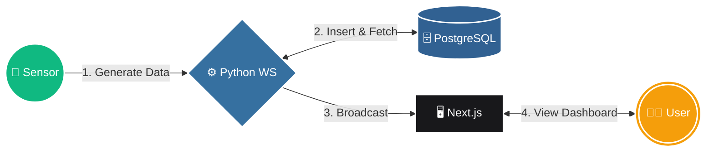
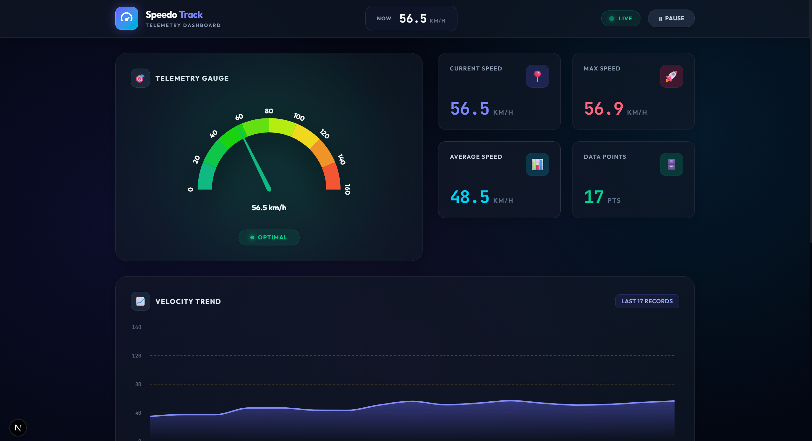
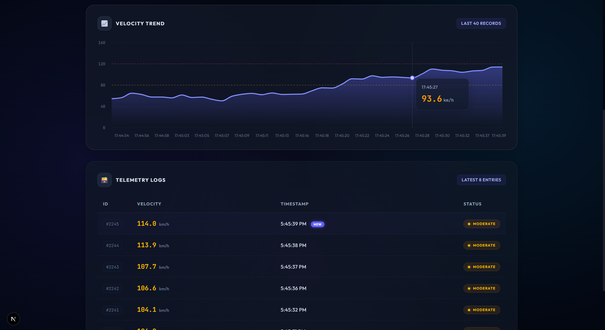
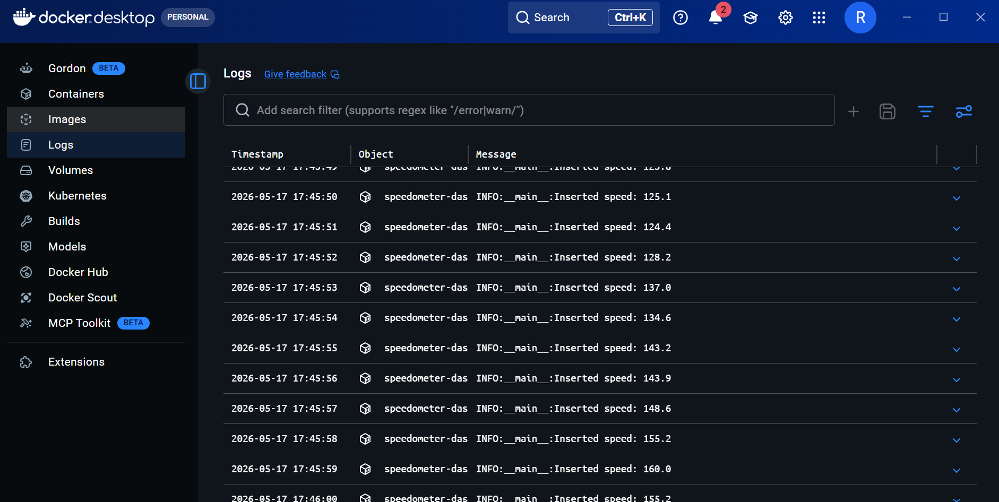
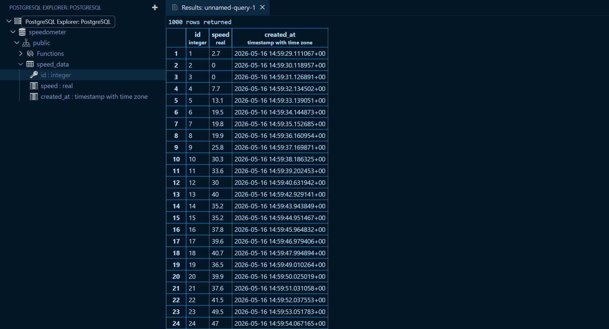
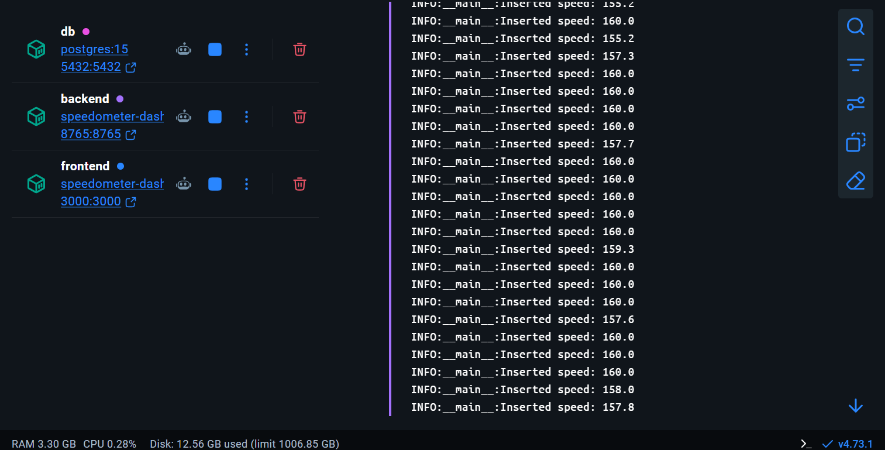

# Real-Time Speedometer App 🏎️


## Table of Contents
1. [Introduction](#introduction)
2. [Problem Statement](#problem-statement)
3. [Solution](#solution)
4. [Architectural Diagram](#architectural-diagram)
5. [Tech Stack](#tech-stack)
6. [Installation & Setup](#installation)
7. [Visual Gallery](#gallery)
8. [Key Endpoints](#endpoints)
9. [Project Structure](#structure)

---

## <a id="introduction"></a>1. Introduction
The Real-Time Speedometer App is a fully dockerized, full-stack application designed to track, store, and visualize time-series speed data. This dashboard serves as a highly responsive monitoring tool that consumes live sensor data seamlessly using modern WebSockets. It features a premium, aesthetic dark-mode UI with glassmorphism components, custom SVG icons, and smooth layout rendering.

## <a id="problem-statement"></a>2. Problem Statement
In many IoT and telemetry applications, sensor data is generated continuously and needs to be analyzed instantaneously. Traditional polling architectures fail to deliver a true "real-time" experience and overload servers. The challenge is to build an efficient, scalable, and dockerized system that processes 1-second interval time-series data and pushes it to a live UI without latency.

## <a id="solution"></a>3. Solution
This project implements an event-driven architecture using **WebSockets**. A Python backend simulates a physical sensor, generating continuous speed records every second and persisting them in a robust **PostgreSQL** database. Upon insertion, the backend broadcasts the newly acquired data directly to a **Next.js** frontend, instantly rendering the telemetry on a dynamic D3-based speedometer.

## <a id="architectural-diagram"></a>4. Architectural Diagram


## <a id="tech-stack"></a>5. Tech Stack
- **Frontend**: Next.js (React), TailwindCSS, `react-d3-speedometer`, `recharts`, Next Google Fonts (Outfit & JetBrains Mono)
- **Backend**: Python 3.11, `asyncio`, `websockets`, `asyncpg`
- **Database**: PostgreSQL 15
- **Infrastructure**: Docker & Docker Compose

## <a id="installation"></a>6. Installation and Setup

### Prerequisites
- **Docker** and **Docker Compose** installed on your system.

### Steps
1. **Clone the repository** (if applicable) and navigate to the root directory:
   ```bash
   cd speedometer-dashboard
   ```
2. **Start the containers** using Docker Compose:
   ```bash
   docker-compose up --build -d
   ```
3. **Access the application**:
   Open your browser and navigate to:
   👉 **[http://localhost:3000](http://localhost:3000)**

4. **View Backend Logs** (Optional):
   ```bash
   docker logs -f speedometer_backend
   ```

---

## <a id="gallery"></a>📸 7. Visual Gallery

<table width="100%" style="border-collapse: collapse;">
  <!-- ROW 1 -->
  <tr>
    <td width="50%" align="center" valign="top">
      <b>1. Live Speedometer Dashboard</b><br><br>
      <br><br>
      <i>The main Next.js interface displaying real-time telemetry.</i>
    </td>
    <td width="50%" align="center" valign="top">
      <b>2. Velocity Trend Chart</b><br><br>
      <br><br>
      <i>The dynamic Area Chart tracking the speed history over time.</i>
    </td>
  </tr>
  <!-- ROW 2 -->
  <tr>
    <td width="50%" align="center" valign="top">
      <b><br>4. Backend Terminal Logs</b><br><br>
      <br><br>
      <i>Python backend asynchronously inserting data and broadcasting to clients.</i>
    </td>
    <td width="50%" align="center" valign="top">
      <b><br>5. PostgreSQL Database View</b><br><br>
      <br><br>
      <i>Direct view of the `speed_data` table storing the telemetry.</i>
    </td>
  </tr>
  <!-- ROW 3 -->
  <tr>
    <td width="50%" align="center" valign="top">
      <b><br>6. Docker Containers Running</b><br><br>
      <br><br>
      <i>The 3 isolated containers seamlessly communicating in Docker Desktop.</i>
    </td>
  </tr>
</table>

---

## <a id="endpoints"></a>8. Key Endpoints
While this architecture heavily relies on WebSockets rather than traditional REST APIs, the primary interaction nodes are:

| Service | Protocol | Address | Description |
|---------|----------|---------|-------------|
| **Frontend UI** | HTTP | `http://localhost:3000` | The main Next.js web application. |
| **WebSocket Hub** | WS | `ws://localhost:8765` | Python backend broadcasting speed telemetry. |
| **Database** | TCP | `localhost:5432` | Raw access to the PostgreSQL `speedometer` database. |

## <a id="structure"></a>9. Project Structure
```text
speedometer-dashboard/
├── docker-compose.yml       # Orchestrates DB, Backend, and Frontend containers
├── init.sql                 # Bootstraps the PostgreSQL database schema
├── Dockerfile               # Frontend (Next.js) Docker container configuration
├── package.json             # Frontend dependencies
├── src/
│   └── app/
│       └── page.js          # Main Next.js dashboard UI component
├── backend/
│   ├── Dockerfile           # Backend (Python) Docker container configuration
│   ├── main.py              # Sensor simulation, DB insertion, and WS Server
│   └── requirements.txt     # Python dependencies
└── assets/
    └── gallery/             # Application screenshots for documentation
```

---

## <a id="conclusion"></a>10. Conclusion
This assignment successfully demonstrates the ability to architect, build, and containerize a modern, real-time web application. By leveraging WebSockets and Docker Compose, we ensure low-latency data delivery and an environment-agnostic deployment process, addressing the core challenges of live telemetry monitoring.

## Thank You!
Thank you for reviewing this project! I hope this dashboard demonstrates a strong understanding of full-stack engineering, real-time data flow, and modern containerization practices. If you have any questions or feedback, please feel free to reach out.
